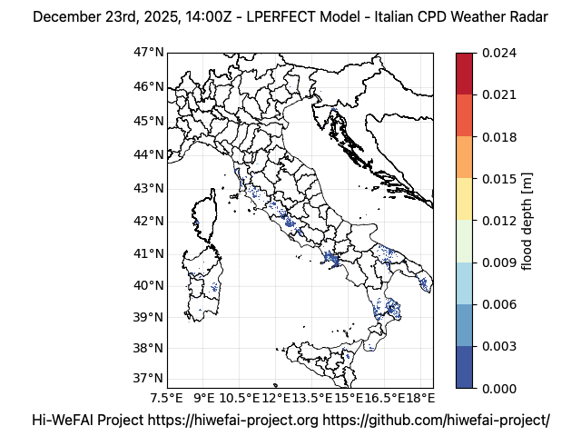
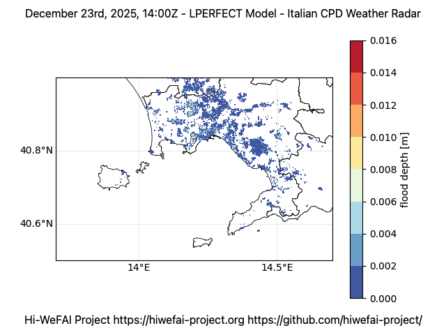

# LPERFECT
**Lagrangian Parallel Environmental Runoff and Flood Evaluation for Computational Terrain**

LPERFECT is a lightweight **Lagrangian runoff + flood routing model** designed for fast flood screening on gridded domains.
It is engineered to be **restartable**, **MPI-parallel** (row-slab + particle migration), and **production-ready** from a software-architecture point of view (modular package layout, clear separation of concerns).



LPERFECT fits naturally in the **Hi-WeFAI** workflow, where blended precipitation forcing (radar nowcasting, stations, NWP)
feeds a fast impact layer producing flood depth and risk maps.

Project website: https://www.hiwefai-project.org

## Documentation

- A ready-to-go recipe to make the LPERFECT model up and running [`link`](docs/getting_started.md)
- Detailed information about how to configure the LPERFECT model [`link`](docs/configure.md)
- Description in depth how the model works [`link`](docs/model_description.md)
- Summary about rain forcing metodologies [`link`](docs/rain_forcing.md)
- Running nested domains (e.g., 90 m national + 30 m regional + 10 m city) via multi-domain configs is supported while keeping the same heterogeneous parallelization schema.
- Some remarks about the LPERFECT parallelization schema for MPI and GPU [`link`](docs/parallelization_schema.md)
- Detailed guide to preparing **domain** and **rainfall forcing** NetCDF inputs (with GDAL/CDO/NCO examples and Italy-oriented datasets) [link](docs/data.md)
- How to use GPT-friendly metrics JSON outputs with AI assistants [`link`](docs/ai.md)
- Installation guide covering development, workstation, and HPC workflows [`link`](docs/installation.md)
- Step-by-step real-world walkthrough:
  - **Italy, December 23rd 2025 intense rain event** [`link`](docs/use_case_01.md)
  - **Italy, March 14th 2025 severe rainfall event** [`link`](docs/use_case_02.md)
  - **Campania Region, September 23rd 2025 severe rainfall event** [`link`](docs/use_case_03.md)
- Utilities:
  - Making the model domain quick and easy [`link`](docs/make_domain.md)
  - Map model results on geographical features (i.e., municipality areas) [`link`](docs/output_to_geo.md)
  - Rise alert notification in case of threshold overpassing [`link`](docs/alert_generator.md)
  - Running the model on Slurm HPC systems [`link`](docs/hpc.md)
  - Converting VMI radar images to rain rate stored in a NetCDF file (supports `--input-dir` for alphabetical ingestion) [`link`](docs/wr_to_rain.md)
  - Converting WRF from meteo@uniparthenope data to rain rate stored in a NetCDF file [`link`](docs/meteouniparthenope-wrf_to_rainrate.md)
  - Converting weather station data (measured or predicted) to rain rate stored in a NetCDF file (time aggregation, Kriging interpolation) [`link`](docs/ws_to_rainrate.md)

## Installation

```bash
pip install -r requirements.txt
```

See the full installation guide in [`docs/installation.md`](docs/installation.md) for pip and Conda workflows across development, workstation, and HPC environments.

MPI runs require an MPI runtime (OpenMPI / MPICH) and `mpi4py`.
Optional GPU acceleration requires CuPy and can be enabled with `--device gpu`.

## Run

### Serial
```bash
python main.py --config config.json
```

### GPU (optional)
```bash
python main.py --config config.json --device gpu
```

### Shared-memory parallelism (optional, per rank)
Enable threaded particle advection/aggregation inside each rank via the config:
```json
{
  "compute": {
    "shared_memory": {
      "enabled": true,
      "workers": 8,
      "min_particles_per_worker": 20000
    }
  }
}
```

### MPI
```bash
mpirun -np 8 python main.py --config config.json
```

Useful overrides:
```bash
python main.py --config config.json --out-nc flood.nc
python main.py --config config.json --restart-in restart_state.nc
python main.py --config config.json --restart-out restart_state.nc
python main.py --config config.json --travel-time-mode auto
python main.py --config config.json --outflow-geojson out/outflow_hits.geojson
python main.py --config config.json --runoff-only-risk
```

### Parallelization switches (mix-and-match)
- **MPI distributed memory**: `compute.mpi.enabled` = `true|false|null(auto)`, `compute.mpi.decomposition` = `auto|balanced|even`, `compute.mpi.min_rows_per_rank` to avoid tiny slabs. Ranks are pruned automatically when the active rows cannot satisfy the minimum-per-rank constraint. CLI overrides: `--mpi-mode`, `--mpi-decomposition`, `--mpi-min-rows`.
- **Parallelization schema**: choose `compute.parallelization.schema="slab"` (default row slabs + migration) or `"particles"` (even particle-only distribution across ranks). Control I/O with `compute.parallelization.io="rank0"` (default) or `"all"` to write per-rank outputs (files suffixed with `_rankXXXX`). CLI overrides: `--parallel-schema` and `--parallel-io`.
- **MPI migration tuning**: `compute.mpi.migration_mode="agg_nonblocking"` (default) for aggregated nonblocking exchanges or `"legacy"` for the older neighbor/Alltoall path; use `compute.mpi.timing_every_steps` and `compute.mpi.overlap_migration` to emit and overlap migration timing diagnostics.
- **MPI load balancing**: `compute.mpi.balance.every_steps` / `every_sim_s` force a particle-aware rebalance on a fixed cadence; `compute.mpi.balance.auto` triggers when the max/min particle count ratio across ranks exceeds `imbalance_threshold`.
- **Shared memory threads (per rank)**: `compute.shared_memory.enabled/workers/min_particles_per_worker/chunk_size`.
- **GPU**: `compute.device = "gpu"` (per rank) or override with `--device gpu`.

Examples:
- Serial + GPU only: `--mpi-mode disabled --device gpu`.
- MPI-only: `--mpi-mode enabled --mpi-decomposition balanced`.
- MPI + threads: set `compute.shared_memory.enabled=true` with `mpirun ...`.
- Full heterogeneous: `mpirun -np 8 python main.py --config cfg.json --device gpu --mpi-decomposition balanced`.

Output cadence:
- `output.save_every_s`: append a new time slice to the configured NetCDF every N simulated seconds (e.g., `3600` for hourly snapshots).
- `output.rotate_every_s`: write a new NetCDF every N simulated seconds, using the `output.out_netcdf` basename with `_0000.nc`, `_0001.nc`, ... suffixes.
- The final state is always written, even if it does not align exactly with the interval.
- If `output.outflow_geojson` (or `--outflow-geojson`) is set, the model writes a GeoJSON with the grid cells where particles exit to the sea/lakes, including the number of particles per save interval.
- At the end of each run, LPERFECT logs a simulation quality report summarizing mass balance, hydrological consistency, and particle statistics.

## Input NetCDFs

### 5.1 Domain NetCDF (`domain.domain_nc`)
Required 2D variables (dims `latitude,longitude`):
- `dem` (float): DEM elevation (m). Finite values define the **active domain**.
- `d8` (int): D8 directions (`model.encoding` = `esri` or `cw0_7`).
- `cn` (float): Curve Number (0–100). Values outside become 0.

Optional 2D variable:
- `channel_mask` (0/1 or bool): Cells treated as channel (faster travel time).

Required coordinates (names configurable via `domain.varmap`):
- `latitude(latitude)` and `longitude(longitude)` with `degrees_north` / `degrees_east` units.

Required CF grid mapping (per `/cdl/domain.cdl`):
- Include a `crs` variable with `grid_mapping_name`, `epsg_code`, `semi_major_axis`, and `inverse_flattening`.
- Each spatial variable (`dem`, `d8`, `cn`, `channel_mask`) should reference it via `grid_mapping = "crs"`.

### Rain NetCDFs
Each rain source follows the CDL template in `/cdl/rain_time_dependent.cdl`:
- **Time-dependent rainfall**: `rain_rate(time,latitude,longitude)` with units `mm h-1`
- Static grids are only accepted if you disable `rain.schema.require_time_dim`.

Time-dependent files must include a `time(time)` coordinate with:
- `description = "Time"`
- `long_name = "time"`
- `units = "hours since 1900-01-01 00:00:0.0"`

Rainfall files also include a `crs` grid-mapping variable, and `rain_rate` should
reference it via `grid_mapping = "crs"`.

Time selection:
- `previous` (default): pick the latest time slice **at or before** the simulation timestamp. Use this to hold a 10-minute rain rate constant across all 5-second model steps.
- `nearest`: pick the time slice closest to simulation timestamp (`model.start_time` + elapsed); switches at the midpoint between rain timestamps.
- `step`: pick `time[k]` by index.

## Model description

A more detailed description of the model is available here [link](docs/model_description.md)

### Runoff generation (SCS Curve Number)
LPERFECT uses cumulative SCS-CN:
- accumulate precipitation `P_cum` (mm)
- convert to cumulative runoff `Q_cum` (mm)
- incremental runoff is `dQ = Q_cum(t) - Q_cum(t-1)`

### Lagrangian routing
Incremental runoff is converted into **particles** (small fixed water volumes).  
Particles hop along D8 with travel-time gating; travel times can be fixed scalars or automatically derived from cell area plus representative hillslope/channel velocities (with configurable bounds).
Set `model.runoff_only_risk=true` or pass `--runoff-only-risk` to skip particle routing and compute the risk index directly from cumulative runoff.

### Parallelization
MPI mode uses:
- **load-balanced slab decomposition** (contiguous row blocks per rank, weighted by active cells; falls back to even slabs)
- **particle migration** via `Alltoallv` after advection (neighbor-only when possible, skipped entirely when no particles leave a slab)
- **optional shared-memory threads** per rank to accelerate particle advection and slab accumulation (independent of GPU/MPI)
- **rank-aware MPI enable/disable switches** so GPU-only or threads-only runs remain serial even when `mpirun` is used
- **rank0-only I/O** (domain read, rain read, restart+output writes)
- **particle-parallel spawn scatter**: when using the `particles` schema, new particles spawned on rank 0 are scattered evenly to all ranks every step without disturbing already-placed particles

## Restart usage

Start fresh (and write restart every `restart.every` steps):
```bash
python main.py --config config.json
```

Resume:
```bash
python main.py --config config.json --restart-in restart_state.nc
```

MPI restarts:
- rank0 loads restart
- cumulative fields are scattered as slabs
- particles are redistributed by row ownership

## Outputs

Results NetCDF contains:
- `flood_depth(time,latitude,longitude)` in meters
- `risk_index(time,latitude,longitude)` unitless (if enabled)
- `inundation_mask(time,latitude,longitude)` (0/1, thresholded depth)
- `flood_depth_max(latitude,longitude)` and `inundation_mask_max(latitude,longitude)`
- `time(time)` coordinate (hours since 1900-01-01 00:00:0.0)

Select which of these variables are written with `output.variables` in the JSON config (`"all"` or a list of variable names).

Example plot (with optional Campania bounding box and labeled municipal boundaries):
```bash
python utils/output_plot.py \
  --flood data/flood_depth.nc \
  --domain data/domain.nc \
  --plot-var flood_depth \
  --time-index 0 \
  --bbox 13.7 39.9 15.9 41.6 \
  --overlay data/boundaries/campania_municipalities.geojson \
  --overlay-label-field name \
  --out data/flood_depth_campania_t0.png \
  --log-level INFO
```

The script can also batch-render every time step by omitting `--time-index`, optionally regrid to align DEM/flood grids (`--regrid dem_to_flood` or `--regrid flood_to_dem`), and overlay administrative boundaries when `geopandas` is installed (e.g., `--overlay muni.geojson --overlay-label-field NAME`). Use `--overlay-notext` for the same overlay without labels, and note that overlays are clipped to the plotting domain bounds. Use `--plot-var` to choose outputs like `risk_index` or `inundation_mask`. Non-positive `flood_depth` values are always transparent in the plot.

## Use case
### Italy, December 23rd 2025 intense rain event



A complete, reproducible workflow (data download, radar-to-rain conversion, configuration, run, and visualization) is documented in [docs/use_case_01.md](docs/use_case_01.md).
